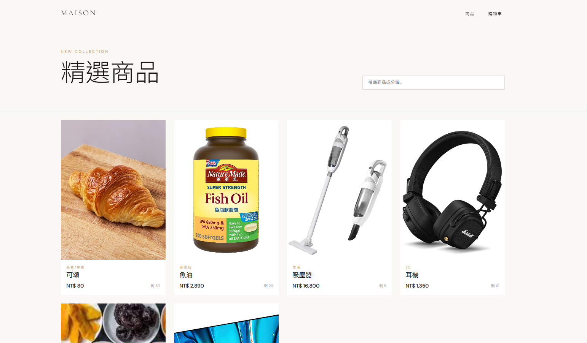
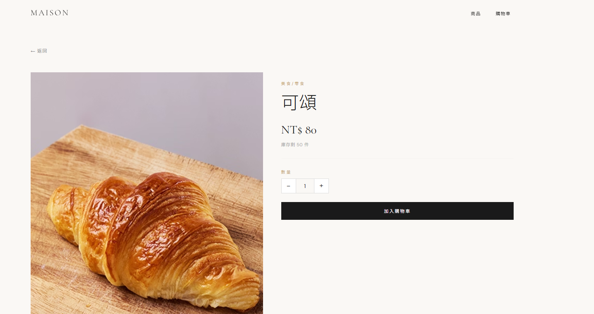
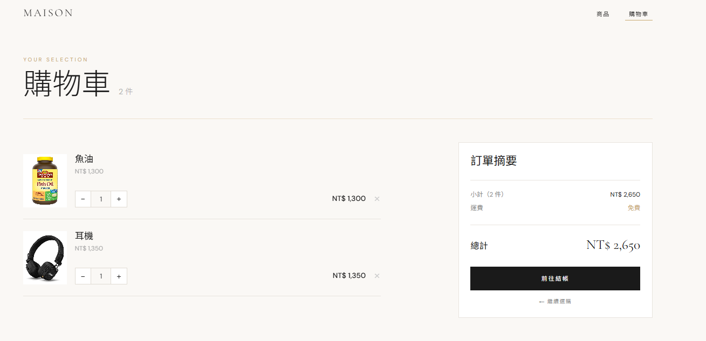
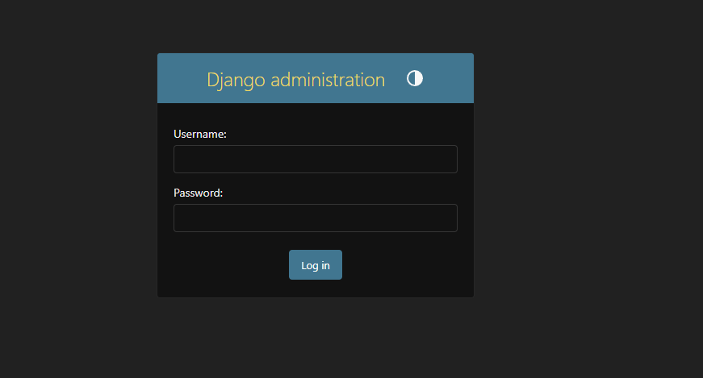
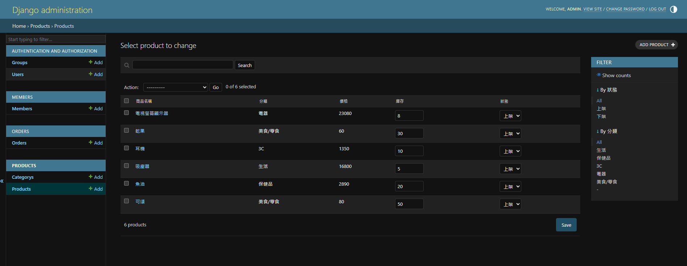

# 🛒 簡易電商前後台系統

一個使用 **React + Django REST Framework** 建置的前後端分離電商專案，目的是學習如何將現代前端框架與 Django 後台結合，實現完整的電商管理功能。

---

## 🌐 線上網址

| 項目 | 網址 |
|------|------|
| 🖥️ 前台（顧客介面） | https://Jen041794.github.io/my-ecommerce |
| ⚙️ 後台（管理介面） | https://my-ecommerce-production-7da4.up.railway.app/admin |
| 🔌 API 根目錄 | https://my-ecommerce-production-7da4.up.railway.app/api |

---

## 📐 系統架構

```
前台 React (GitHub Pages)          後台 Django (Railway)
        ↓                                   ↓
  顧客瀏覽商品、加入購物車    ←→    管理員新增/管理商品、訂單、會員
  localhost:3000 / GitHub Pages     localhost:8000 / Railway
```

### 技術選型

| 層級 | 技術 | 說明 |
|------|------|------|
| 前端框架 | React 18 | 元件化 UI，使用 Hooks |
| 前端路由 | React Router v6 | HashRouter（相容 GitHub Pages）|
| HTTP 請求 | Axios | 串接 Django REST API |
| 後端框架 | Django 5 | Python Web 框架 |
| API 建置 | Django REST Framework | 提供 JSON API |
| 跨域處理 | django-cors-headers | 允許前端跨域請求 |
| 靜態檔案 | WhiteNoise | Django 靜態資源服務 |
| 資料庫 | SQLite | 輕量資料庫（開發/部署用）|
| 前端部署 | GitHub Pages + GitHub Actions | 自動化 CI/CD |
| 後端部署 | Railway | Python 雲端平台 |

---

## 🗂️ 專案結構

```
my-ecommerce/
├── .github/
│   └── workflows/
│       └── deploy.yml       ← GitHub Actions 自動部署
├── backend/                 ← Django 後端
│   ├── ecommerce/           ← 主設定（settings, urls）
│   ├── products/            ← 商品管理
│   ├── orders/              ← 訂單管理
│   ├── members/             ← 會員管理
│   ├── dashboard/           ← 銷售報表
│   ├── Procfile             ← Railway 啟動指令
│   ├── runtime.txt          ← Python 版本指定
│   └── requirements.txt     ← Python 套件清單
├── frontend/                ← React 前端
│   └── src/
│       ├── api/
│       │   └── axios.js     ← API 連線設定
│       ├── components/
│       │   └── Navbar.jsx   ← 導覽列
│       └── pages/
│           ├── ProductList.jsx   ← 商品列表頁
│           ├── ProductDetail.jsx ← 商品詳細頁
│           └── Cart.jsx          ← 購物車頁
└── README.md
```

---

## ✨ 功能介紹

## 📸 畫面截圖

### 前台（顧客端）

- 🛍️ **商品列表** — 顯示所有上架商品，含圖片、價格、分類
- 📄 **商品詳細頁** — 查看商品詳情，加入購物車

| 商品列表 | 商品詳細頁 |
|----------|------------|
|  |  |

- 🛒 **購物車** — 新增/刪除商品、調整數量、計算總價

| 購物車 |
|--------|
|  |

### 後台（管理員端）

- 📦 **商品管理** — 新增/編輯/刪除商品，設定上架/下架狀態
- 👥 **會員管理** — 查看會員資料，啟用/停用帳號
- 🧾 **訂單管理** — 查看訂單列表，更新訂單狀態
- 🗂️ **分類管理** — 管理商品分類



---

## 🔌 API 端點

| 方法 | 端點 | 說明 |
|------|------|------|
| GET | `/api/products/` | 取得所有商品 |
| GET | `/api/products/?status=on` | 只取上架商品 |
| GET | `/api/products/{id}/` | 取得單一商品 |
| POST | `/api/products/` | 新增商品 |
| GET | `/api/members/` | 取得所有會員 |
| GET | `/api/orders/` | 取得所有訂單 |
| GET | `/api/categories/` | 取得所有分類 |

---

## 🚀 本地開發

### 後端啟動

```bash
cd backend
python -m venv venv
venv\Scripts\activate        # Windows
pip install -r requirements.txt
python manage.py migrate
python manage.py createsuperuser
python manage.py runserver   # http://127.0.0.1:8000
```

### 前端啟動

```bash
cd frontend
npm install
npm start                    # http://localhost:3000
```

---

## ⚙️ 環境變數

### 後端（Railway Variables）

| 變數名稱 | 說明 |
|----------|------|
| `SECRET_KEY` | Django 密鑰 |
| `DEBUG` | 除錯模式（False）|
| `DJANGO_SUPERUSER_USERNAME` | 管理員帳號 |
| `DJANGO_SUPERUSER_EMAIL` | 管理員 Email |
| `DJANGO_SUPERUSER_PASSWORD` | 管理員密碼 |

### 前端（GitHub Secrets）

| 變數名稱 | 說明 |
|----------|------|
| `REACT_APP_API_URL` | Django API 網址 |

---

## 📦 CI/CD 流程

每次 push 到 `main` 分支時，GitHub Actions 會自動：

1. 安裝 Node.js 18
2. 安裝前端套件 `npm install`
3. 打包前端 `npm run build`（自動注入環境變數）
4. 部署到 GitHub Pages

後端則由 **Railway** 監聽 GitHub repo，自動觸發：

1. 安裝 Python 套件
2. 執行 `migrate`
3. 收集靜態檔案 `collectstatic`
4. 啟動 Gunicorn 伺服器

---

## 🛠️ 使用技術一覽


---

## 📝 學習重點

這個專案主要練習以下概念：

- **前後端分離架構**：React 負責 UI，Django 只提供 API
- **REST API 設計**：使用 DRF ViewSet 快速建立 CRUD API
- **CORS 處理**：跨網域請求的設定與安全性
- **CI/CD 自動部署**：GitHub Actions 觸發自動化流程
- **環境變數管理**：區分開發與正式環境設定